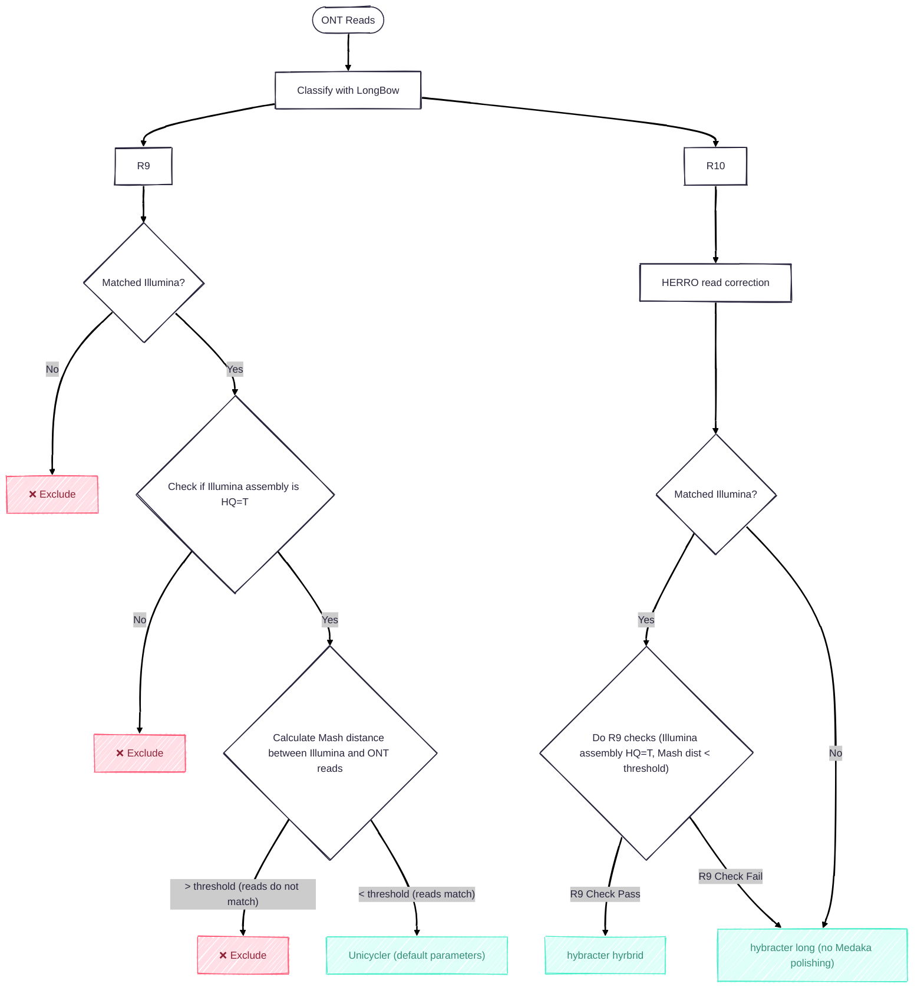

# atb-longread-workflow
Proposed workflow for inclusion of long read data into AllTheBacteria.

## ONT

All Oxford Nanopore (ONT) reads are first classified into **R9** or **R10** chemistry using the **LongBow classifier**. From there, each chemistry follows it's own path.
 
### R9 Reads
 
R9 reads require matched Illumina data to proceed, samples without it are immediately excluded. 

For those with matched Illumina, the Illumina assembly must have a **high-quality (HQ = True)** value for their Illumina assembly in AllTheBacteria — failures are excluded. 

Samples with matched Illumina are then checked to see if the Illumina and ONT reads are likely to come from the same sample, by calculating a **Mash distance** calculated between the Illumina and ONT reads. If the distance exceeds the threshold (reads do not match), the sample is excluded. If it falls below the threshold (reads match), then we perform a hybrid assembly with **Unicycler** using default parameters.

#### Alternative R9 pathway

We have considered an alternate pathway for R9 reads. For samples that pass the Illumina read matching checks, check read depth.

- if depth > X, send down the `hybracter hybrid` pathway, using a long-read first assembly approach
- if depth < X, use Unicycler for a short-read assembly first approach

This method would require an estimate of genome size using the species detected with Sylph.
 
### R10 Reads
 
All R10 reads first undergo **HERRO read correction**. After correction, the workflow checks for matched Illumina data:
 
- **With matched Illumina:** the same R9 quality checks are applied (HQ = True and Mash distance below threshold). Samples passing both checks are assembled with **hybracter in hybrid mode**. Samples failing either check are assembled with **hybracter in long-read mode**, without Medaka polishing.
- **Without matched Illumina:** samples go directly to **hybracter in long-read mode**, without Medaka polishing.

### Overall workflow suggestion

## PacBio

Goal is to send all PacBio reads down a single path. Open to suggestions of what this should be - is Flye sufficient? Can we use Hybracter or is this only for ONT data?
